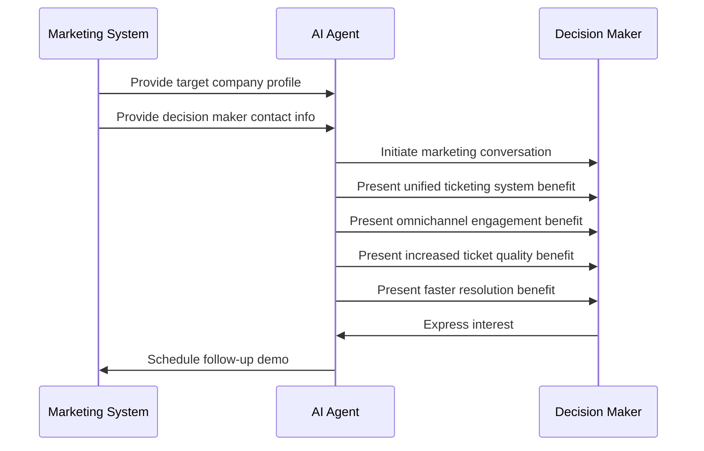
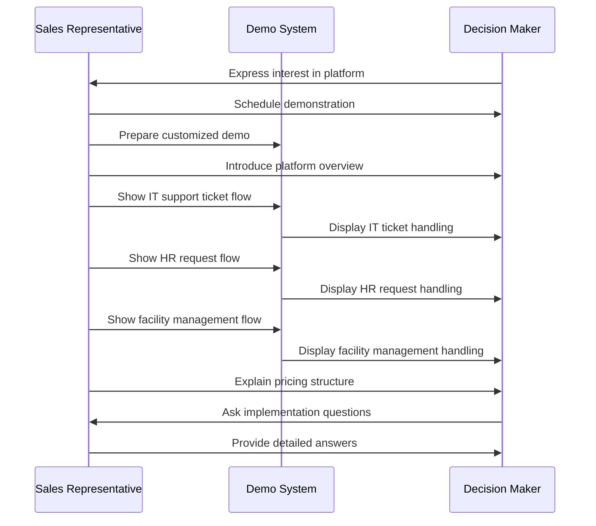
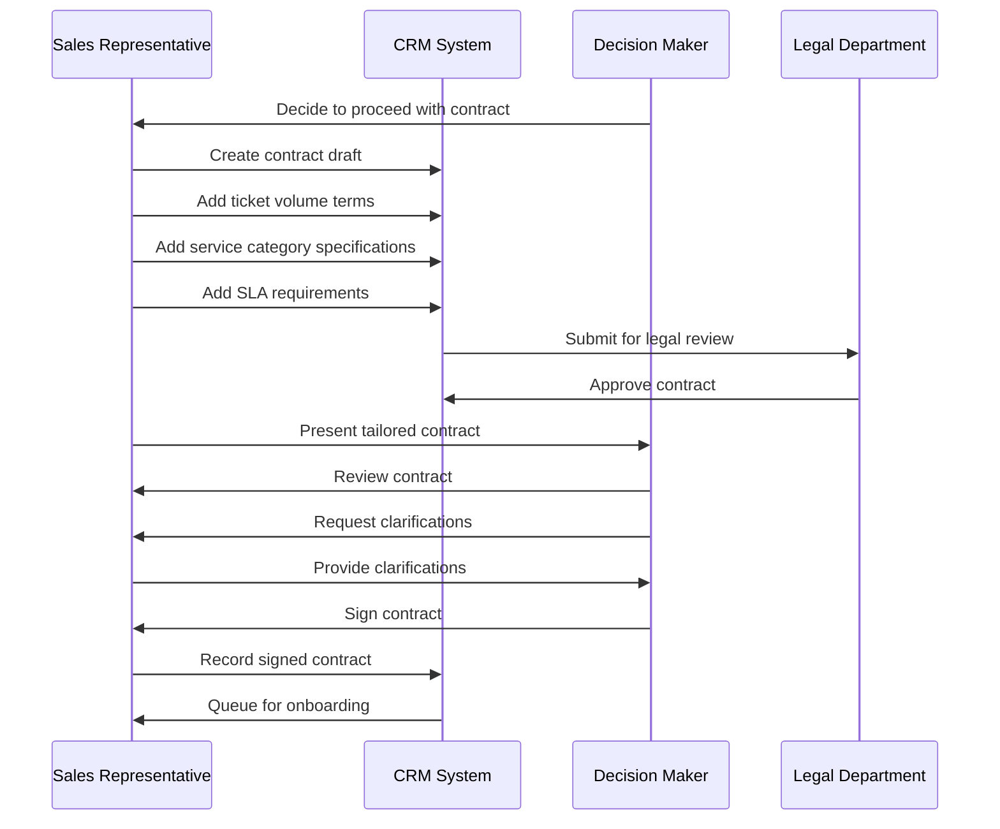
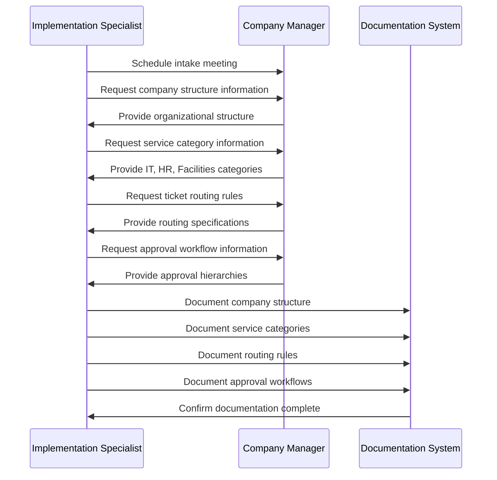
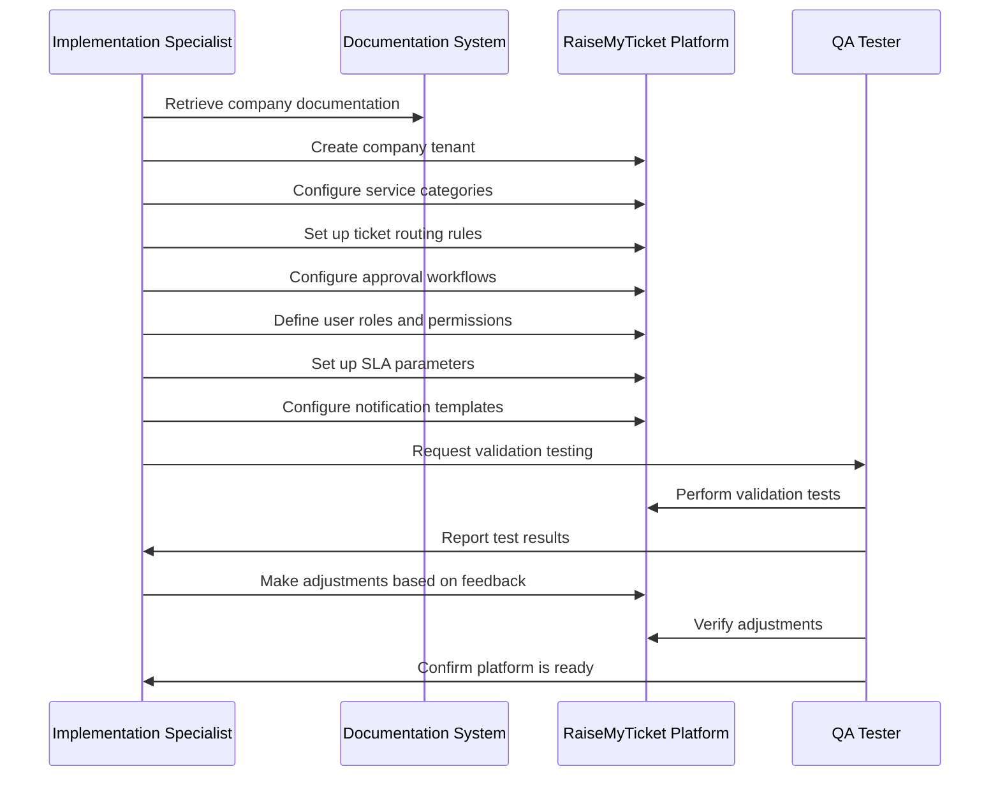
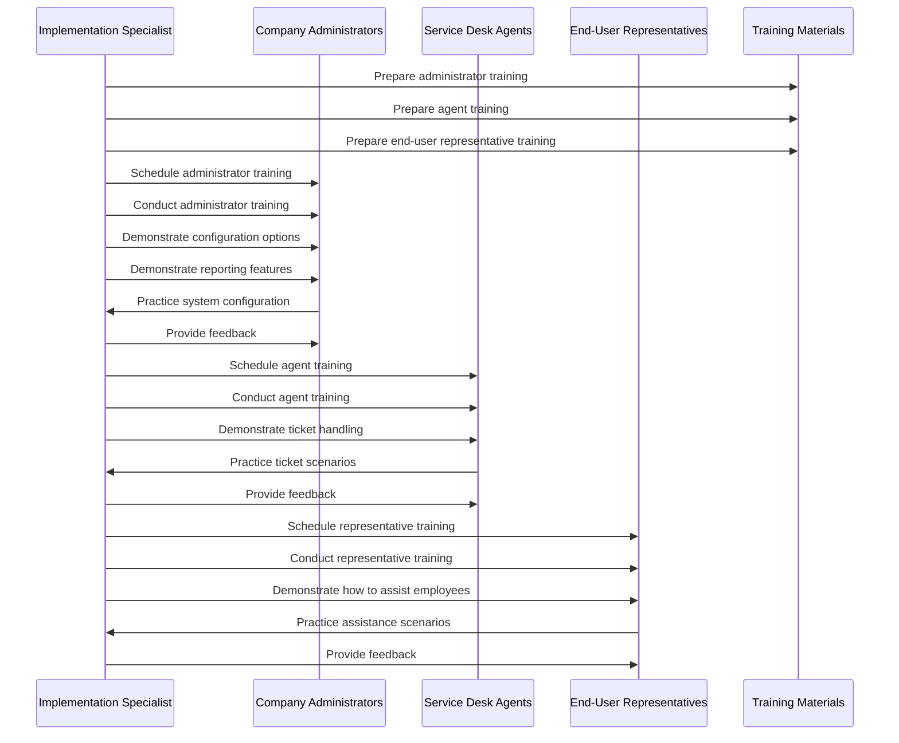
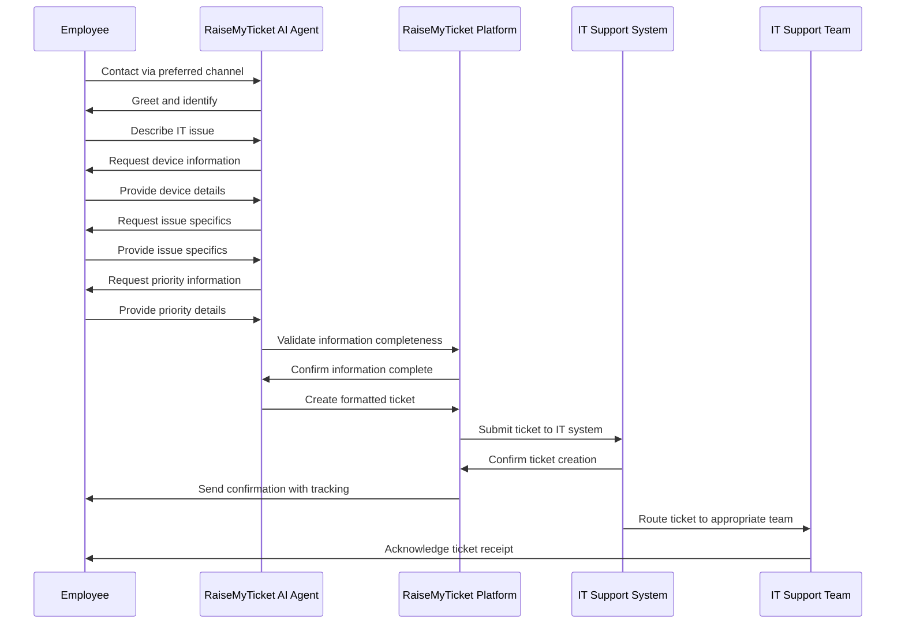
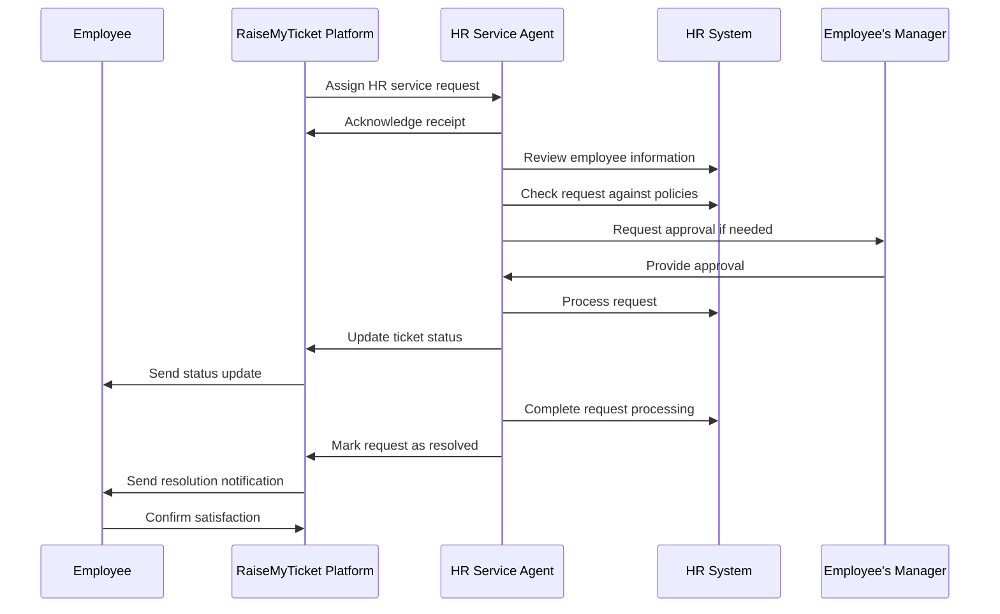
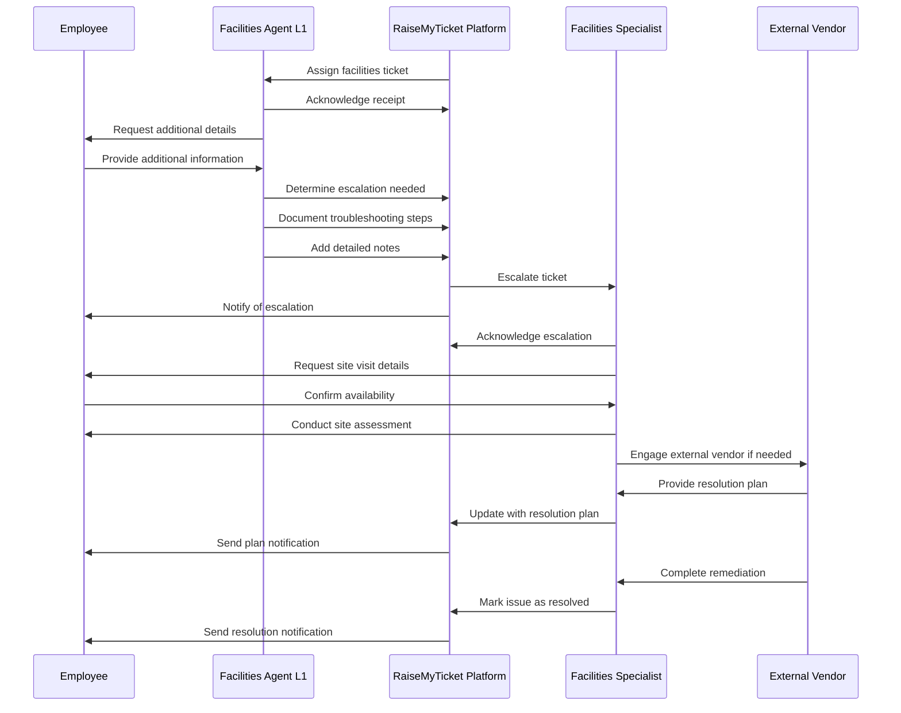

# RaiseMyTicket.com: Complete BDD Feature and Sequence Diagrams Documentation

RaiseMyTicket.com is a unified ticket management platform contracted by organizations to act on behalf of their employees. The platform offers multiple benefits: a single, unified ticketing input system, omnichannel hassle‑free engagement, increased ticket quality through complete initial data capture, and faster ticket resolution. This document outlines the system's requirements and behaviors through a series of features written in Gherkin. It also provides text‑based sequence diagrams (in Mermaid syntax) for each scenario.

---

## Table of Contents

1. [Marketing Feature](#marketing-feature)
2. [Sales Feature](#sales-feature)
3. [New Company Onboarding Feature](#new-company-onboarding-feature)
4. [Production Usage Feature](#production-usage-feature)
5. [Validation of Completeness and Non-Overlap](#validation)

---

## 1. Marketing Feature {#marketing-feature}

This feature describes how the RaiseMyTicket.com AI Agent targets decision makers at companies to promote its unique selling points:  
- A unified ticketing input system that removes employee confusion;  
- Omnichannel, hassle‑free user engagement (no multiple GUI logins or confusing ticket forms);  
- Increased ticket quality by capturing and validating all required/optional fields on first pass; and  
- Faster ticket resolution due to higher-quality ticket data.

### Feature File: Marketing

```gherkin
Feature: RaiseMyTicket.com Marketing
  As a provider of RaiseMyTicket.com,
  I want to demonstrate the benefits of a unified, omnichannel, high-quality ticketing system
  So that decision makers understand the value and are motivated to contract with us.

  Scenario: AI Agent Presents Unique Selling Points to Decision Maker
    Given a decision maker at a target company is identified and their contact information is available
    When the AI Agent initiates a marketing conversation via email or chat
    And the AI Agent presents the benefits of a unified ticketing input system, omnichannel engagement, increased ticket quality, and faster resolution speed
    Then the decision maker understands the value proposition
    And expresses interest in a follow‑up demo or contract discussion
```

### Sequence Diagram: AI Agent Presents Unique Selling Points



## 2. Sales Feature {#sales-feature}

This feature describes the sales process for RaiseMyTicket.com, from initial interest to contract finalization. It emphasizes how the platform's demo showcases its comprehensive ticket management capabilities across different service categories.

### Feature File: Sales

```gherkin
Feature: RaiseMyTicket.com Sales Process
  As a sales representative for RaiseMyTicket.com,
  I want to convert interested decision makers into contracted customers
  So that we can expand our customer base and generate revenue.

  Scenario: Demonstrating the Platform to Interested Decision Maker
    Given a decision maker has expressed interest in RaiseMyTicket.com
    When the sales representative schedules a demonstration
    And shows how the platform handles tickets across IT support, HR requests, and facility management
    And explains the pricing structure based on ticket volume and service categories
    Then the decision maker can observe the platform's capabilities first-hand
    And receive answers to specific questions about implementation

  Scenario: Finalizing Contract with a New Customer
    Given a decision maker wants to proceed with contracting RaiseMyTicket.com
    When the sales representative prepares a tailored contract
    And includes specific terms for ticket volume, service categories, and SLAs
    Then the decision maker reviews and signs the contract
    And the company is queued for onboarding
```

### Sequence Diagram: Demonstrating the Platform



### Sequence Diagram: Finalizing Contract



## 3. New Company Onboarding Feature {#new-company-onboarding-feature}

This feature outlines the process of onboarding a new company to the RaiseMyTicket.com platform, including data collection, system configuration, and training.

### Feature File: New Company Onboarding

```gherkin
Feature: New Company Onboarding
  As a RaiseMyTicket.com implementation specialist,
  I want to efficiently onboard new contracted companies
  So that they can start using the platform with minimal delay.

  Scenario: Collecting Company-Specific Data
    Given a new company has signed a contract
    When the implementation specialist conducts an intake meeting
    And collects information about service categories, ticket routing rules, and approval workflows
    Then the collected information is documented
    And made available for system configuration

  Scenario: Configuring the Platform for a New Company
    Given company-specific data has been collected
    When the implementation specialist configures the RaiseMyTicket.com platform
    And sets up service categories, ticket routing, approval workflows, and user roles
    Then the platform is ready for validation testing
    And meets the specific needs of the company

  Scenario: Training Company Representatives
    Given the platform has been configured for a new company
    When the implementation specialist schedules training sessions
    And conducts training for administrators, service desk agents, and end-user representatives
    Then the company representatives understand how to use and manage the platform
    And can effectively support their employees' ticketing needs
```

### Sequence Diagram: Collecting Company-Specific Data



### Sequence Diagram: Configuring the Platform



### Sequence Diagram: Training Company Representatives



## 4. Production Usage Feature {#production-usage-feature}

This feature describes the day-to-day operation of the RaiseMyTicket.com platform, focusing on ticket creation, processing, and resolution across different service categories.

### Feature File: Production Usage

```gherkin
Feature: Production Usage of RaiseMyTicket.com
  As an employee of a contracted company,
  I want to use RaiseMyTicket.com to submit and track service requests
  So that my issues are resolved efficiently and transparently.

  Scenario: Submitting an IT Support Ticket
    Given an employee needs IT support
    When the employee contacts RaiseMyTicket.com via chat, email, or phone
    And provides details about their IT issue
    And the AI Agent collects all required information
    Then a properly formatted ticket is created in the company's IT support system
    And the employee receives confirmation with tracking information
    And the ticket is routed to the appropriate IT support team

  Scenario: Processing an HR Service Request
    Given an HR service request has been submitted
    When the HR service agent receives the ticket
    And reviews the provided information
    And processes the request according to company policies
    Then the employee receives updates on the request status
    And the request is resolved according to established SLAs

  Scenario: Escalating a Complex Facilities Management Issue
    Given a facilities management ticket cannot be resolved at the first level
    When the facilities agent determines escalation is needed
    And transfers the ticket to a specialist with detailed notes
    Then the specialist receives all relevant information
    And the employee is notified of the escalation
    And the issue is addressed by the appropriate specialist
```

### Sequence Diagram: Submitting an IT Support Ticket



### Sequence Diagram: Processing an HR Service Request



### Sequence Diagram: Escalating a Complex Facilities Management Issue



## 5. Validation of Completeness and Non-Overlap {#validation}

The feature set described above covers the complete lifecycle of the RaiseMyTicket.com platform:

1. **Marketing Feature**: Covers the initial introduction of the platform's benefits to potential clients.
2. **Sales Feature**: Addresses the process of converting interest into contractual relationships.
3. **New Company Onboarding Feature**: Details the implementation process for new contracted companies.
4. **Production Usage Feature**: Illustrates the day-to-day operation of the platform across different service categories.

These features are designed to be distinct with minimal overlap, each addressing a specific phase in the platform's relationship with client organizations:

- Marketing targets potential clients who are not yet customers
- Sales focuses on demonstrating capabilities and finalizing contracts
- Onboarding applies only to new companies that have signed contracts but are not yet operational
- Production usage applies to fully implemented companies with employees actively using the system

Together, these features provide a comprehensive view of the RaiseMyTicket.com platform's functionality, from initial marketing to ongoing usage, ensuring that all stakeholders have a clear understanding of the system's capabilities and behaviors.
